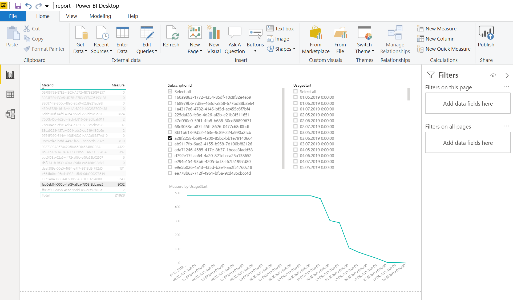

# Azure Stack lab - Day 4: Azure Stack Operator
During third day we will practice:
- Managing quotas, plans, offers and subscriptions
- Creating custom marketplace items
- Billing

## Prerequisities
Check [README](./README.md)

## Step XX - Connect to Azure Stack Administration via PowerShell
Install PowerShell modules according to [documentation](https://docs.microsoft.com/cs-cz/azure-stack/operator/azure-stack-powershell-install)

Connect
```powershell
$baseDomain = "local.azurestack.external"
$arm = "adminmanagement"
$vault = "adminvault"
$AADTenantName = "<myDirectoryTenantName>.onmicrosoft.com"

$armEndpoint = "https://$arm.$baseDomain"
$vaultDns = "$vault.$baseDomain" 
$vaultEndpoint = "https://$vault.$baseDomain" 

Add-AzureRMEnvironment -Name "AzureStackAdmin" -ArmEndpoint $endpoint `
    -AzureKeyVaultDnsSuffix $vaultDns `
    -AzureKeyVaultServiceEndpointResourceId $vaultEndpoint

$AuthEndpoint = (Get-AzureRmEnvironment -Name "AzureStackAdmin").ActiveDirectoryAuthority.TrimEnd('/')
$TenantId = (invoke-restmethod "$($AuthEndpoint)/$($AADTenantName)/.well-known/openid-configuration").issuer.TrimEnd('/').Split('/')[-1]

Add-AzureRmAccount -EnvironmentName "AzureStackAdmin" -TenantId $TenantId
```

Test you can access admin information, eg.:
```powershell
Get-AzsScaleUnitNode
```

## Step XX - prepare tools for custom marketplace items
Structure of required files is documented [here](https://docs.microsoft.com/en-us/azure-stack/operator/azure-stack-create-and-publish-marketplace-item). Packaging tool is in marketplaceItems folder, but you may want to check whether there is new version available [here](https://www.aka.ms/azurestackmarketplaceitem).

## Step XX - custom marketplace item using VM image
## Step XX - custom marketplace item using ARM template and default GUI
We will use example in netDemo folder which is based on ARM template we built in previous labs. Look into file structure - DeploymentTemplate store ARM templates, Icons store icons in various resolutions, strings folder defines item name and description. In root folder there is Manifest.json with basic links and UIDefinition.json which in our case does not introduce any specific GUI elements, rather just referencing ARM deployment GUI.

You can package this item like this:

```powershell
cd marketplaceItems
./AzureGalleryPackager.exe package -m netDemo/Manifest.json -o .\packages\
```
## Step XX - custom marketplace item using custom GUI components

## Step XX - using PowerShell to create and manage quotas, plans, offers and subscriptions

Note in Azure Stack there is no difference in performance of Standard HDD and Premium SSD storage types (but for Azure consistency both are available so tempaltes and scripts work in both environments). There are IOPS limits that are function of VM type. VMs of type A, D or F have limits set to 500 IOPS per data disk (bigger VMs allows for more disks to be attached) while DS and FS comes with 2300 IOPS limit.

First let's prepare some quotas.

```powershell
$region = "yourregionname"
New-AzureRMResourceGroup -Location $region -Name portfolio

# Storage quotas
New-AzsStorageQuota -Name "q-storage-128GB" -CapacityInGb 128 -NumberOfStorageAccounts 100 
New-AzsStorageQuota -Name "q-storage-1TB" -CapacityInGb 1024 -NumberOfStorageAccounts 100 
New-AzsStorageQuota -Name "q-storage-10TB" -CapacityInGb 10240 -NumberOfStorageAccounts 100 

# Compute vCore quotas
New-AzsComputeQuota -Name "q-cores-2" -AvailabilitySetCount 2 -CoresCount 2 -VmScaleSetCount 2 -VirtualMachineCount 2 -StandardManagedDiskAndSnapshotSize 0 -PremiumManagedDiskAndSnapshotSize 0
New-AzsComputeQuota -Name "q-cores-10" -AvailabilitySetCount 10 -CoresCount 10 -VmScaleSetCount 10 -VirtualMachineCount 10 -StandardManagedDiskAndSnapshotSize 0 -PremiumManagedDiskAndSnapshotSize 0
New-AzsComputeQuota -Name "q-cores-50" -AvailabilitySetCount 50 -CoresCount 50 -VmScaleSetCount 50 -VirtualMachineCount 50 -StandardManagedDiskAndSnapshotSize 0 -PremiumManagedDiskAndSnapshotSize 0

# Compute Disk storage quotas
New-AzsComputeQuota -Name "q-disks-512GB" -AvailabilitySetCount 0 -CoresCount 0 -VmScaleSetCount 0 -VirtualMachineCount 0 -StandardManagedDiskAndSnapshotSize 512 -PremiumManagedDiskAndSnapshotSize 512
New-AzsComputeQuota -Name "q-disks-5TB" -AvailabilitySetCount 0 -CoresCount 0 -VmScaleSetCount 0 -VirtualMachineCount 0 -StandardManagedDiskAndSnapshotSize 5120 -PremiumManagedDiskAndSnapshotSize 5120
New-AzsComputeQuota -Name "q-disks-50TB" -AvailabilitySetCount 0 -CoresCount 0 -VmScaleSetCount 0 -VirtualMachineCount 0 -StandardManagedDiskAndSnapshotSize 51200 -PremiumManagedDiskAndSnapshotSize 51200

# Network quotas
New-AzsNetworkQuota -Name "q-net-1ip" -MaxPublicIpsPerSubscription "1"
New-AzsNetworkQuota -Name "q-net-5ip" -MaxPublicIpsPerSubscription "5"
New-AzsNetworkQuota -Name "q-net-10ip" -MaxPublicIpsPerSubscription "10"
New-AzsNetworkQuota -Name "q-net-50ip" -MaxPublicIpsPerSubscription "50"
```

Now we will create plans. Idea is to have one starting plan and rest will be addon plans.
```powershell
New-AzsPlan -Name "p-base" `
    -ResourceGroupName portfolio `
    -DisplayName "p-base" `
    -Description "Base plan with no IaaS/PaaaS resources" `
    -Location $region `
    -SkuIds @("Microsoft.KeyVault", "Microsoft.Subscriptions") `
    -QuotaIds $((Get-AzsSubscriptionsQuota -Name delegatedProviderQuota).Id), `
    $((Get-AzsKeyVaultQuota).Id)

New-AzsPlan -Name "p-cores-2" `
    -ResourceGroupName portfolio `
    -DisplayName "p-cores-2" `
    -Description "Addon plan with 2 cores" `
    -Location $region `
    -SkuIds @("Microsoft.Compute") `
    -QuotaIds $((Get-AzsComputeQuota -Name "q-cores-2").Id)

New-AzsPlan -Name "p-cores-10" `
    -ResourceGroupName portfolio `
    -DisplayName "p-cores-10" `
    -Description "Addon plan with 10 cores" `
    -Location $region `
    -SkuIds @("Microsoft.Compute") `
    -QuotaIds $((Get-AzsComputeQuota -Name "q-cores-10").Id)

New-AzsPlan -Name "p-cores-50" `
    -ResourceGroupName portfolio `
    -DisplayName "p-cores-50" `
    -Description "Addon plan with 50 cores" `
    -Location $region `
    -SkuIds @("Microsoft.Compute") `
    -QuotaIds $((Get-AzsComputeQuota -Name "q-cores-50").Id)

New-AzsPlan -Name "p-disks-512GB" `
    -ResourceGroupName portfolio `
    -DisplayName "p-disks-512GB" `
    -Description "Addon plan with 512GB disk capacity" `
    -Location $region `
    -SkuIds @("Microsoft.Compute") `
    -QuotaIds $((Get-AzsComputeQuota -Name "q-disks-512GB").Id)

New-AzsPlan -Name "p-disks-5TB" `
    -ResourceGroupName portfolio `
    -DisplayName "p-disks-5TB" `
    -Description "Addon plan with 5TB disk capacity" `
    -Location $region `
    -SkuIds @("Microsoft.Compute") `
    -QuotaIds $((Get-AzsComputeQuota -Name "q-disks-5TB").Id)

New-AzsPlan -Name "p-disks-50TB" `
    -ResourceGroupName portfolio `
    -DisplayName "p-disks-50TB" `
    -Description "Addon plan with 50TB disk capacity" `
    -Location $region `
    -SkuIds @("Microsoft.Compute") `
    -QuotaIds $((Get-AzsComputeQuota -Name "q-disks-50TB").Id)

New-AzsPlan -Name "p-storage-128GB" `
    -ResourceGroupName portfolio `
    -DisplayName "p-storage-128GB" `
    -Description "Addon plan with 128GB blob/table/queue storage capacity" `
    -Location $region `
    -SkuIds @("Microsoft.Storage") `
    -QuotaIds $((Get-AzsStorageQuota -Name "q-storage-128GB").Id)

New-AzsPlan -Name "p-storage-1TB" `
    -ResourceGroupName portfolio `
    -DisplayName "p-storage-1TB" `
    -Description "Addon plan with 1TB blob/table/queue storage capacity" `
    -Location $region `
    -SkuIds @("Microsoft.Storage") `
    -QuotaIds $((Get-AzsStorageQuota -Name "q-storage-1TB").Id)

New-AzsPlan -Name "p-storage-10TB" `
    -ResourceGroupName portfolio `
    -DisplayName "p-storage-10TB" `
    -Description "Addon plan with 10TB blob/table/queue storage capacity" `
    -Location $region `
    -SkuIds @("Microsoft.Storage") `
    -QuotaIds $((Get-AzsStorageQuota -Name "q-storage-10TB").Id)

New-AzsPlan -Name "p-net-1ip" `
    -ResourceGroupName portfolio `
    -DisplayName "p-net-1ip" `
    -Description "Addon plan with 1 public IP" `
    -Location $region `
    -SkuIds @("Microsoft.Network") `
    -QuotaIds $((Get-AzsNetworkQuota -Name "q-net-1ip").Id)

New-AzsPlan -Name "p-net-5ip" `
    -ResourceGroupName portfolio `
    -DisplayName "p-net-5ip" `
    -Description "Addon plan with 5 public IP" `
    -Location $region `
    -SkuIds @("Microsoft.Network") `
    -QuotaIds $((Get-AzsNetworkQuota -Name "q-net-5ip").Id)

New-AzsPlan -Name "p-net-10ip" `
    -ResourceGroupName portfolio `
    -DisplayName "p-net-10ip" `
    -Description "Addon plan with 10 public IP" `
    -Location $region `
    -SkuIds @("Microsoft.Network") `
    -QuotaIds $((Get-AzsNetworkQuota -Name "q-net-10ip").Id)

New-AzsPlan -Name "p-net-50ip" `
    -ResourceGroupName portfolio `
    -DisplayName "p-net-50ip" `
    -Description "Addon plan with 50 public IP" `
    -Location $region `
    -SkuIds @("Microsoft.Network") `
    -QuotaIds $((Get-AzsNetworkQuota -Name "q-net-50ip").Id)
```

We can now combine base plans and add on plans to build offers.
```powershell
New-AzsOffer -Name "trial-2core-512GBdisk-128GBstore-1ip" `
    -DisplayName "trial-2core-512GBdisk-128GBstore-1ip" `
    -ResourceGroupName portfolio `
    -State Private  `
    -BasePlanIds $(Get-AzsPlan -Name "p-base" -ResourceGroupName portfolio).Id, `
    $(Get-AzsPlan -Name "p-cores-2" -ResourceGroupName portfolio).Id, `
    $(Get-AzsPlan -Name "p-disks-512GB" -ResourceGroupName portfolio).Id, `
    $(Get-AzsPlan -Name "p-storage-128GB" -ResourceGroupName portfolio).Id, `
    $(Get-AzsPlan -Name "p-net-1ip" -ResourceGroupName portfolio).Id
```

Let's now create subscription.

```powershell
$owner = "username@domain.onmicrosoft.com"
New-AzsUserSubscription -Owner $owner `
    -OfferId $((Get-AzsManagedOffer -Name "trial-2core-512GBdisk-128GBstore-1ip" -ResourceGroupName portfolio).Id) `
    -DisplayName "customer1-projectA"
```

Make sure you can connect to it via tenant portal. Create public IP. One should work, second should fail as we do not have enough quota.

Your customer has validated Azure Stack in trial and now wants to keep his subscription, but unlock more quota. Let's upgrade his plan and add more quota. In portal go to User subscriptions, click on subscription customer1-projectA, click Add-ons and add p-net-5ip.

Go to tenant portal and check you can create additional public IPs now.

You customer now needs additional subscription for its second project. Is OK to have just very basic quota there. It can have the same owner or different one. Owners can invite members to any number of subscriptions they own.

```powershell
$owner = "username@domain.onmicrosoft.com"
New-AzsUserSubscription -Owner $owner `
    -OfferId $((Get-AzsManagedOffer -Name "trial-2core-512GBdisk-128GBstore-1ip" -ResourceGroupName portfolio).Id) `
    -DisplayName "customer1-projectB"
```

Cleanup. **We are doing this in lab. In real world make sure you do not delete your customers subscriptions! Good way to prevent this is to use Locks on key resources, try that.**

```powershell
# Delete subscription (careful! We are doing this in our lab only, you do not want to destroy customers environment!)
Get-AzsUserSubscription | where {$_.DisplayName -eq "customer1-projectA"} | Remove-AzsUserSubscription -Force
Get-AzsUserSubscription | where {$_.DisplayName -eq "customer1-projectB"} | Remove-AzsUserSubscription -Force

# When subscriptions in offer are deleted, you can delete offer
Remove-AzsOffer -Name "trial-2core-512GBdisk-128GBstore-1ip" -ResourceGroupName portfolio -Force

# When no offers use our plans, we can delete those
Remove-AzsPlan -Name "p-starting" -ResourceGroupName portfolio -Force
Remove-AzsPlan -Name "p-cores-2" -ResourceGroupName portfolio -Force
Remove-AzsPlan -Name "p-cores-10" -ResourceGroupName portfolio -Force
Remove-AzsPlan -Name "p-cores-50" -ResourceGroupName portfolio -Force
Remove-AzsPlan -Name "p-disks-512GB" -ResourceGroupName portfolio -Force
Remove-AzsPlan -Name "p-disks-5TB" -ResourceGroupName portfolio -Force
Remove-AzsPlan -Name "p-disks-50TB" -ResourceGroupName portfolio -Force
Remove-AzsPlan -Name "p-storage-128GB" -ResourceGroupName portfolio -Force
Remove-AzsPlan -Name "p-storage-1TB" -ResourceGroupName portfolio -Force
Remove-AzsPlan -Name "p-storage-10TB" -ResourceGroupName portfolio -Force
Remove-AzsPlan -Name "p-net-1ip" -ResourceGroupName portfolio -Force
Remove-AzsPlan -Name "p-net-5ip" -ResourceGroupName portfolio -Force
Remove-AzsPlan -Name "p-net-10ip" -ResourceGroupName portfolio -Force
Remove-AzsPlan -Name "p-net-50ip" -ResourceGroupName portfolio -Force

# When no plans use our quota, we can delete those
Remove-AzsStorageQuota -Name "q-storage-128GB" -Force
Remove-AzsStorageQuota -Name "q-storage-1TB" -Force
Remove-AzsStorageQuota -Name "q-storage-10TB" -Force
Remove-AzsComputeQuota -Name "q-cores-2" -Force
Remove-AzsComputeQuota -Name "q-cores-10" -Force
Remove-AzsComputeQuota -Name "q-cores-50" -Force
Remove-AzsComputeQuota -Name "q-disks-512GB" -Force
Remove-AzsComputeQuota -Name "q-disks-5TB" -Force
Remove-AzsComputeQuota -Name "q-disks-50TB" -Force
Remove-AzsNetworkQuota -Name "q-net-1ip" -Force
Remove-AzsNetworkQuota -Name "q-net-5ip" -Force
Remove-AzsNetworkQuota -Name "q-net-10ip" -Force
Remove-AzsNetworkQuota -Name "q-net-50ip" -Force

```

## Step XX - administrative tasks in privileged endpoint

If there is need to get access to deeper logs (typically during troubleshooting support case with Microsoft) you can access [privileged endpoint](https://docs.microsoft.com/en-us/azure-stack/operator/azure-stack-privileged-endpoint) and get [deep logs](https://docs.microsoft.com/cs-cz/azure-stack/operator/azure-stack-diagnostics)


## Step XX - billing
Azure Stack provides usage information API. One is Tenant API that is designed for tenants to gather usage details themselves. We will use Provider API to gather usage of all tenants for billing purposes.

First let's get data and store in JSON file. Select start and end time. In this example we will use Daily granularity, but if required, you can go down to Hourly granularity.

```powershell
# Define start and end date
$start = "03-01-2019"
$end = "07-11-2019"

# Load usage data to memory
$usageData = Get-AzsSubscriberUsage -ReportedStartTime $start -ReportedEndTime $end -AggregationGranularity Daily

# Store data in JSON file
$usageData | convertto-json | out-file AzureStackUsage.json
```

We can analyze this file with Power BI. Power Query to load and transform data is in powerbi/dataparsing.query and simple filtered report is in powerbi/report.pbix.



Our example is extremly simple, but Power BI is very powerful and a lot can be achieved there. If you want to go with that please concact Azure data experts. Also subscriptions are represented by ID and meters also which is not very convenient. You may build meter-to-name table and also export subscription-to-name table via API and use join queries in Power BI to get better experience.

Also note that there are 3rd party billing solutions available that might give you exactly what you need without too much effort. Some are even integrated into Azure Stack Administration portal and even to Tenant portal, so you customers can easily access usage data in built-in portal. Good example of such solution is [Cloud Assert](https://www.cloudassert.com/Solutions/Azure-Stack/Usage-and-Billing)
